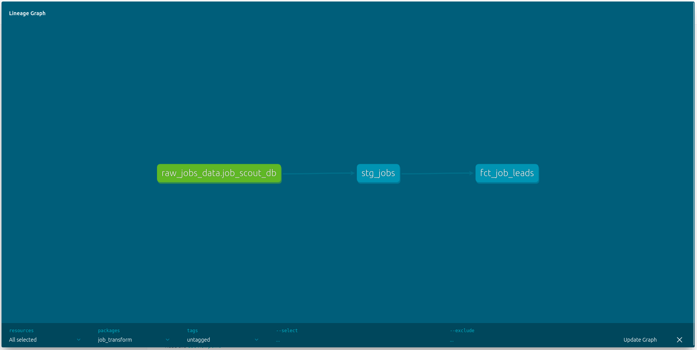

# Cloud-Native Job Market Intelligence Pipeline

## Overview
An end-to-end data engineering system that automates the collection, transformation, and validation of job market data. The project is fully containerized and designed to run as a scheduled production workload on **Azure**.
## Data Lineage

## Technical Stack
*   **Infrastructure:** Docker & Docker Compose (Environment Isolation)
*   **Deployment:** Azure (Linux/IaaS)
*   **Data Ingestion:** Python (REST API & JSON Parsing)
*   **Transformation & Quality:** dbt (PostgreSQL)
*   **Orchestration:** Bash scripting for automated pipeline execution

## Architecture & Features
### 1. Automated Workflow Orchestration
*   Developed shell scripts (`docker_run.sh`) to manage the end-to-end lifecycle: Ingestion -> Transformation -> Validation.
*   Implemented **Automated Testing** using `dbt test` to ensure data quality and schema consistency before delivery.

### 2. Containerized Environment (Docker)
*   Used a slim Python base image with custom-compiled dependencies (`libpq-dev`, `gcc`) to minimize the production footprint.
*   Ensured 100% reproducibility between local development and Cloud deployment through Dockerization.

### 3. Transformation Layer (dbt)
*   Managed the data flow from a raw landing schema to an analytical "Marts" layer.
*   Handled de-duplication and standardized job attributes to enable clean comparative analysis.

## The "Why" behind this project

### The Problem
I was manually searching for jobs and feeling lost in the data. I realized that instead of just looking at job boards, I could treat the job market as a **Data Engineering problem**. I wanted to see which skills were actually trending in real-time without spending hours scrolling.

### Why I built it this way (The Design Choices)

*   **Why Docker?** I’ve had too many "it works on my machine" moments. I wanted to build this once and know it would run anywhere, whether on my laptop or a server.
*   **Why dbt?** Raw API data is usually a mess. I needed to ensure that when I looked at the final "Job Leads" table, the duplicates were gone and the dates were standardized. SQL-based transformation is the most reliable way to do that.
*   **Why the Shell Scripts?** I hate manual steps. I wanted a "One-Command" setup where I could trigger the whole sequence Fetch, Run, and Test, without thinking about it.

### The Goal
The goal wasn't just to find jobs; it was to build a professional-grade "mini-platform." This project allowed me to solve a personal frustration using the same infrastructure patterns (ELT, Containerization, Automated Testing) used by professional data teams.
