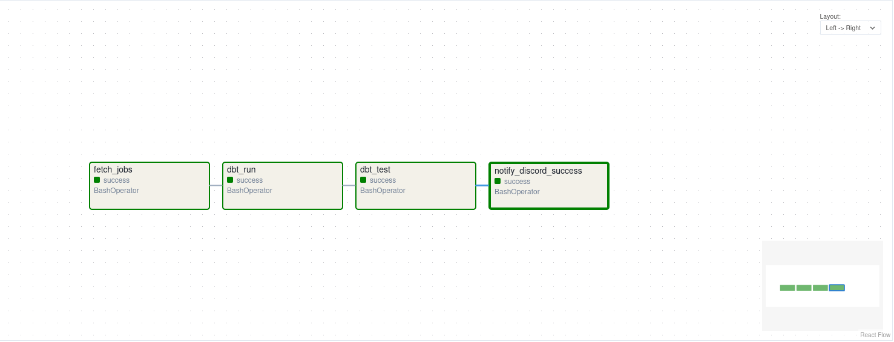

# Cloud-Native Job Market Intelligence Pipeline

## Overview
An end-to-end **Cloud-Native ELT Pipeline** designed to aggregate, normalize, and analyze job market data. This platform demonstrates a professional **Medallion Architecture**, moving data from raw API ingestion to analytics-ready "Marts" using the Modern Data Stack.## Data Lineage

## Technical Stack
*   **Orchestration:** Apache Airflow (LocalExecutor, Dockerized)
*   **Transformation:** dbt (data build tool) - implementing Medallion Architecture
*   **Infrastructure:** Docker & Docker Compose (Environment Parity)
*   **Cloud & Database:** Azure PostgreSQL
*   **Ingestion:** Python (REST API integration, JSON parsing, rate-limiting)
*   **Monitoring & Alerts:** Discord Webhooks (Real-time observability)

## Architecture & Features
### 1. Automated Airflow Orchestration
*   Moved beyond manual scripts by implementing **Apache Airflow**. The pipeline is fully automated, handling dependencies and **automated retries** for API stability.
*   Implemented **Automated Testing** using `dbt test` to ensure data quality and schema consistency before delivery.

### 2. Containerized Environment (Docker)
*   Used a slim Python base image with custom-compiled dependencies (`libpq-dev`, `gcc`) to minimize the production footprint.
*   Ensured 100% reproducibility between local development and Cloud deployment through Dockerization.

### 3. Transformation Layer (dbt)
*   Managed the data flow from a raw landing schema to an analytical "Marts" layer.
*   Handled de-duplication and standardized job attributes to enable clean comparative analysis.

### 4. Real-time Observability (Discord)
*   Implemented an automated notification layer using Discord Webhooks to provide a "Heartbeat" for the system.
*   The system performs a decoupled read-operation on the final "Gold" layer to push the top 5 most recent job leads directly to a private channel upon successful pipeline completion.

### The Goal
The goal wasn't just to find jobs; it was to build a professional-grade "mini-platform." This project allowed me to solve a personal frustration using the same infrastructure patterns (ELT, Containerization, Automated Testing) used by professional data teams.
